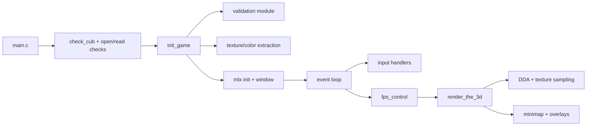
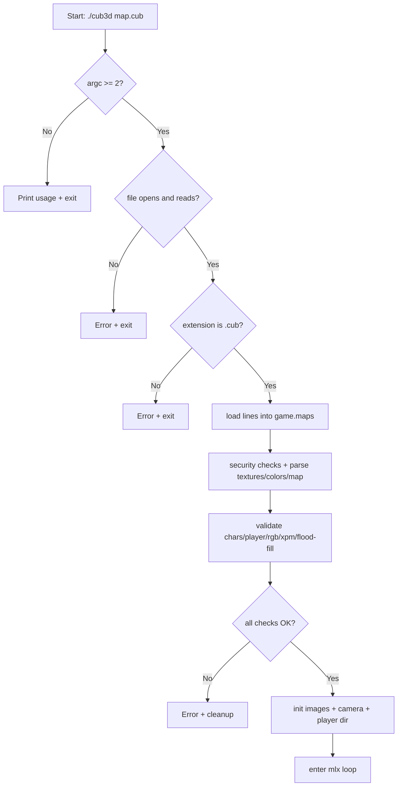
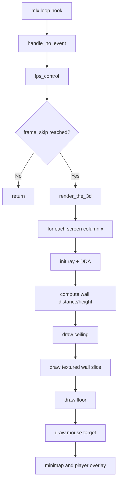

# Cube3D

A raycasting project inspired by Wolfenstein 3D, built in C using MiniLibX.
This repository contains the playable implementation inside `CUB3D_OFFICIAL/`.

## Overview

Cube3D parses a `.cub` scene file, validates map and assets, initializes textures/colors,
then renders a pseudo-3D world with DDA raycasting.

Core features currently implemented:

- `.cub` parsing and validation
- Texture loading (`NO`, `SO`, `WE`, `EA`) from `.xpm`
- Floor/Ceiling RGB colors (`F`, `C`)
- Player spawn + orientation (`N`, `S`, `E`, `W`)
- Wall collision and movement (`W`, `A`, `S`, `D`)
- Rotation with arrow keys + mouse look
- Minimap + FOV/radius rendering

## Tech Stack

- Language: C
- Graphics: MiniLibX (Linux variant)
- Build system: Makefile
- Utility library: custom `libft`

## Project Layout

```text
cube3d/
├── CUB3D_OFFICIAL/
│   ├── includes/           # headers (game structs, validation, render, input)
│   ├── srcs/
│   │   ├── cub3d/          # entrypoint + cleanup
│   │   ├── init_game/      # parsing, extraction, init of game state
│   │   ├── validation/     # security and map checks
│   │   ├── dda/            # DDA ray steps
│   │   ├── ray_cast/       # movement and camera plane
│   │   ├── the_cub_3d_powered/ # 3D rendering + textures
│   │   ├── set_window/     # events and loop
│   │   └── bonus/          # minimap and helper visuals
│   ├── maps/               # valid and invalid sample maps
│   ├── images/             # `.xpm` textures and assets
│   ├── minilibx-linux/
│   └── libft/
└── Readme.md
```

## Build and Run

From the repository root:

```bash
cd CUB3D_OFFICIAL
make
./cub3d maps/test_map4.cub
```

Useful Make targets:

```bash
make        # build cub3d
make clean  # remove object files
make fclean # clean + remove binary
make re     # rebuild from scratch
make run    # valgrind run using maps/test_map4.cub
```

## Controls

- `W` / `A` / `S` / `D`: move forward/left/backward/right
- `Left Arrow` / `Right Arrow`: rotate camera
- `Mouse`: rotate camera (mouse is hidden and re-centered)
- `ESC`: exit

## `.cub` Format

Expected elements:

- `NO path_to_north_texture.xpm`
- `SO path_to_south_texture.xpm`
- `WE path_to_west_texture.xpm`
- `EA path_to_east_texture.xpm`
- `F R,G,B` floor color (0..255 each)
- `C R,G,B` ceiling color (0..255 each)
- Map grid using: `1` wall, `0` empty, `N/S/E/W` player spawn

Notes from current validator behavior:

- Input file must end with `.cub`
- Textures must use `.xpm`
- Duplicate texture/color declarations are rejected
- Exactly one player is required
- Invalid characters are rejected
- Flood-fill is used to reject open maps/leaks

Example:

```text
NO ./images/block.xpm
SO ./images/ruins.xpm
WE ./images/brickWall.xpm
EA ./images/wall1.xpm

F 50,10,50
C 0,0,100

1111111111
1000000001
1000E00001
1000000001
1111111111
```

## Mermaid Diagrams

### 1) High-Level Architecture



### 2) Startup / Validation Flow



### 3) Frame / Render Loop



## Debugging Notes

- There is a `make run` target that executes with Valgrind.
- Sample valid/invalid maps in `CUB3D_OFFICIAL/maps/` are useful to test parser edge cases.

## Authors

Project contributors (as seen in source headers):

- `jonas`
- `fruan-ba`
- `jopereir`
